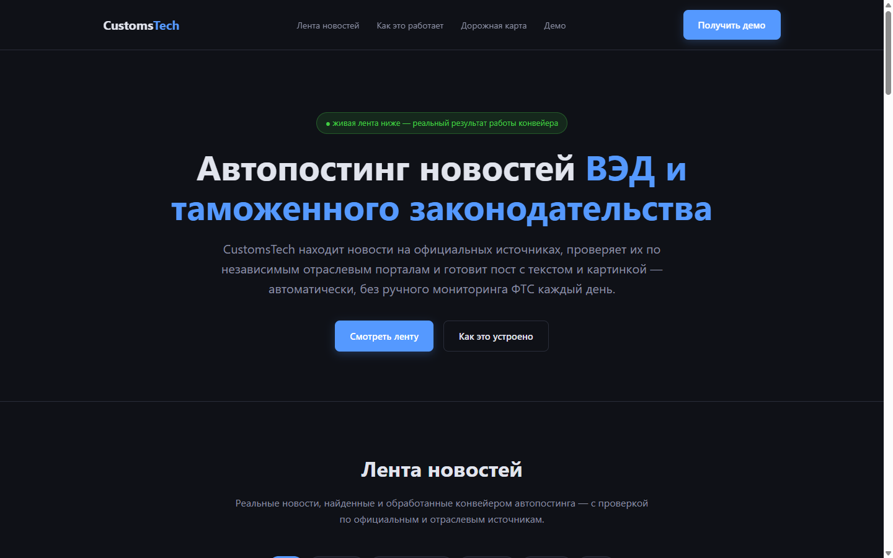
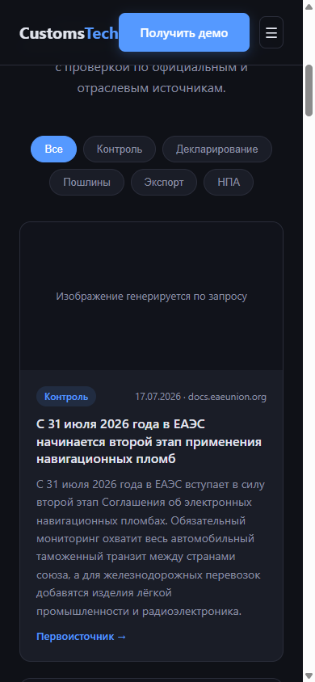
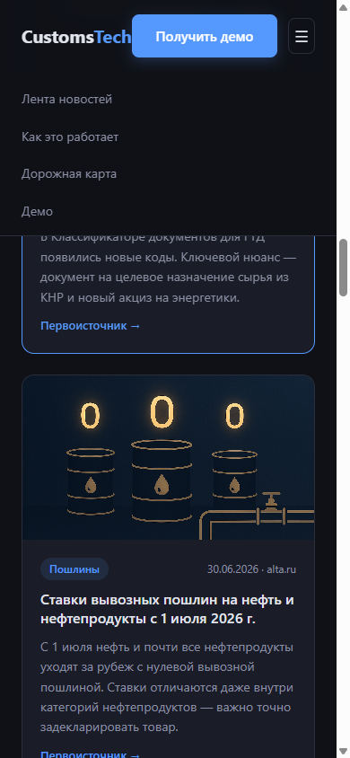
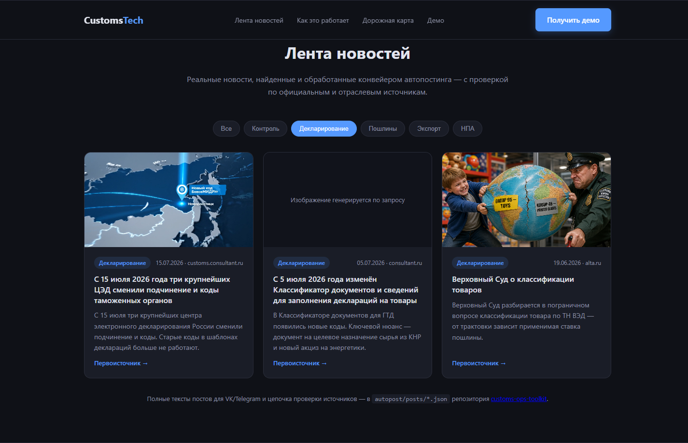
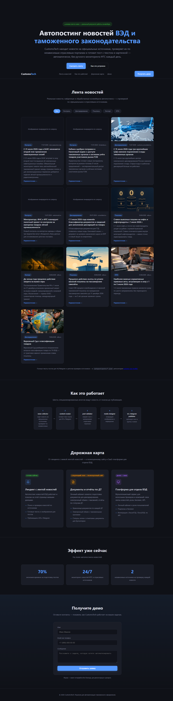

# CustomsTech — лендинг с живой лентой новостей ВЭД

**Живая демо-версия:** https://basilvs.github.io/customstech-landing/
 
Продуктовый лендинг с работающей демонстрацией автопостинга новостей таможенного законодательства: находит, проверяет и оформляет новости в готовые к публикации посты — без ручного мониторинга сайта ФТС.


## Описание проекта

**Название:** CustomsTech — лендинг с живой лентой новостей ВЭД

**Проблема:**  
Таможенные брокеры и отделы ВЭД тратят время на ежедневный мониторинг сайтов ФТС, Минфина, ЕАЭС и отраслевых порталов, чтобы оперативно информировать клиентов. Ручная подготовка постов для соцсетей замедляет реакцию и легко упускает важные изменения.

**Пользователь:**  
Таможенные брокеры, логисты, руководители отделов ВЭД и компаний, которым нужна регулярная, проверенная лента новостей таможенного законодательства.

**Основная функция:**  
Автоматический конвейер находит новости по таможенному законодательству, проверяет их по независимым источникам, готовит текст и медиа для постов и публикует в VK/Telegram. Лендинг показывает результат конвейера в виде живой ленты с фильтрацией по темам.

**Формат результата:**  
- Живая лента новостей на сайте с реальными данными  
- Готовые к публикации посты с текстом и изображением/видео  
- Ссылки на первоисточники для проверки

**Минимальный функционал (MVP):**  
- Работающий лендинг с лентой новостей  
- Фильтр новостей по темам  
- Адаптивная вёрстка и мобильное меню  
- Форма заявки на демо (макет интерфейса)

**В планах:** личный кабинет клиента, документы для декларирования, отчёты по ДТ, SaaS-платформа.

**Технологии:**  
- HTML5, CSS3, JavaScript (vanilla)  
- Статичный сайт без сборки и зависимостей  
- Open Graph, мета-теги, inline SVG favicon

## Для кого

Таможенные брокеры, логисты, отделы ВЭД, которые хотят автоматизировать рутину: мониторинг изменений законодательства, подготовку постов о новостях для соцсетей клиентов, а в перспективе — документооборот по декларациям.

## Идея и сценарий

Посетитель заходит на лендинг → сразу видит живую ленту новостей (не макет — реальные новости, обработанные конвейером автопостинга) → может отфильтровать по теме (декларирование, пошлины, контроль, экспорт, НПА) → открывает первоисточник → смотрит, как устроен конвейер из шести агентов → видит дорожную карту развития → оставляет заявку на демо.

**Что реально работает прямо сейчас:**
- Лента новостей — данные, которые прошли через конвейер `news-collector → content-creator` (см. [customs-ops-toolkit](https://github.com/basilvs/customs-ops-toolkit)): каждая карточка — настоящая новость с проверенным источником, готовым текстом поста и (где сгенерировано) изображением или видео.
- Фильтр по темам.
- Адаптивная вёрстка с мобильным меню.

**Что не работает (и не должно вводить в заблуждение):** форма заявки на демо — макет интерфейса без бэкенда, отправка эмулируется через `alert()`. Это явно указано под формой.

## Запуск локально

Никаких зависимостей и сборки — статичный HTML/CSS/JS.

**Вариант 1 — просто открыть файл:**

Дважды кликнуть `index.html`. Всё, включая ленту новостей и изображения, загрузится и заработает без сервера.

**Вариант 2 — через локальный сервер (если нужен для тестирования на телефоне и т.п.):**

```bash
py -m http.server 8000
# или
npx serve .
```

Открыть `http://localhost:8000`.

## Демонстрация

Desktop, hero и лента новостей:



Мобильная версия, лента новостей:



Мобильное меню открыто:



Фильтр ленты по теме «Декларирование» — реальные новости с реальными сгенерированными изображениями:



Полная страница (лента → «Как это работает» → дорожная карта → эффект → форма демо):



## Структура проекта

```
index.html              — лендинг, единственная точка входа
news-data.js             — данные ленты новостей (реальный выход конвейера автопостинга)
assets/news/             — изображения и видео к новостям, сгенерированные media-designer
assets/screenshots/      — скриншоты для этого README
docs/                    — история планирования и отчёты
```

## Как устроена лента новостей

Каждая запись в `news-data.js` — это реальная новость, прошедшая через конвейер:

```
news-collector → content-creator → post-validator → media-designer → vk-publisher + telegram-publisher
```

1. `news-collector` находит новость на официальном источнике (ФТС, ЕАЭС, consultant.ru) и проверяет по независимому отраслевому порталу.
2. `content-creator` готовит текст поста для VK/Telegram.
3. `post-validator` сверяет с аналогичными материалами на других порталах.
4. `media-designer` генерирует изображение или видео.
5. `vk-publisher` / `telegram-publisher` публикуют пост в реальную группу/канал.

Лендинг переиспользует результат шагов 1–4 (готовые новости, тексты и медиа) в виде живой ленты — без необходимости настраивать VK/Telegram токены, чтобы увидеть, как это работает. Исходные данные и полные тексты постов: `autopost/posts/*.json` в репозитории [customs-ops-toolkit](https://github.com/basilvs/customs-ops-toolkit).

## Дорожная карта

| Этап | Статус | Что входит |
|---|---|---|
| Лендинг с лентой новостей | ✅ Готово | Автопостинг новостей ВЭД, живая лента на сайте (этот репозиторий) |
| Полноценный сайт | 🔜 Следующий | Личный кабинет клиента, подготовка документов для декларирования, электронный обмен с таможней, отчёты по статусам ДТ |
| SaaS-платформа | 🔮 Далее | Мультитенантность (несколько брокеров/компаний), роли пользователей, биллинг, публичный API, интеграция с АльтаГТД / Docs2SQL |

Исходный 30-дневный план и актуальный отчёт о статусе выполнения — в `docs/`.

## Технические детали

- Чистый HTML/CSS/JS, без фреймворков и сборки.
- Тёмная тема, адаптив 320–1440px, мобильное меню.
- Мета-теги, Open Graph, Schema.org (JSON-LD), favicon (inline SVG data URI).
- Проверено в Chromium (Playwright): ошибок в консоли нет.
- Lighthouse-отчёт и инструкция по проверке — в `docs/lighthouse-report-2026-08-11.md`.
